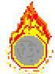
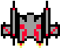

# Javasapiens - Space Fight

## Index
1. [Description of the project](#description-of-the-project)
2. [How to play](#how-to-play)
3. [Requirements](#requirements)
4. [UML Diagram](#uml-diagram)

## Description of the project
Welcome to Space Fight, a game where a spacecraft is sent to save Earth from asteroids heading its way. Embark on a dangerous and thrilling mission that will test your skills.
<p align="center">
  
</p>
<br>
<p align="center">
  
</p>

## How to play
### Game controls:
- `↑`: moves the spacecraft up
- `↓`: moves the spacecraft down
- `→`: moves the spacecraft right
- `←`: moves the spacecraft left
- `Z`: shoots a projectile
- `R`: reset the game
- `ESC`: pause the game

### Asteroids:
The asteroids descend at different speeds, so be careful because if they collide with you, you will be destroyed!

### Rounds:
The game contains 5 rounds that increase in difficulty as the number of asteroids becomes increasingly larger.

### Score:
Each time an asteroid is destroyed by the player, the score increases by 50 points and can be viewed at the top of the screen or when the player loses to be able to view his progress. The maximum possible score in the game is 7500.

### How to win:
After destroying all waves of asteroids, you will win the game.

## Requirements
- Java version: 21+
- SDK: 22+

## UML Diagram
```mermaid
classDiagram
    class Main {
        + void main()
    }

    class Screen {
        - JButton startButton
        - JButton aboutButton
        - JButton exitButton
        - JButton backButton
        - Main main
        - Font gameFont
        - void loadFont()
        - JButton createButton(String text, int x, int y, int width, int height)
        # void paintComponent(Graphics g)
        + void actionPerformed(ActionEvent e)
        - void showGamePhase()
        - void showAboutScreen()
        - void showHomeScreen()
        + void paint(Graphics g, JComponent c)
    }

    class Phase {
        - Image background
        - Spacecraft spacecraft
        - Timer timer
        - List<Asteroid> asteroids
        - boolean inGame
        - int asteroidsKilled
        - int score
        - Font gameFont
        - boolean isPaused
        - boolean showRoundText
        - long roundTextStartTime
        - int roundTextDuration
        - int currentRound
        - void initGame()
        - void addAsteroidsForRound(int round)
        + void paint(Graphics g)
        + void checkCollisions()
        + void actionPerformed(ActionEvent e)
        - void resetGame()
    }

    class Character {
        - Image image
        - int x
        - int y
        - int height
        - int width
        + void load(String imagePath)
    }

    class Asteroid {
        - int speed
        - boolean isVisible
        - String imageFile
        - boolean toggleImage
        + void selectImage()
        + void load()
        + Rectangle getBounds()
        + void move()
        + void resetPosition()
    }

    class Spacecraft {
        - int dx
        - int dy
        - boolean isVisible
        - List<Shoot> shoots
        - int screenWidth
        - int screenHeight
        - long lastShotTime
        - int shotDelay
        + void load()
        + Rectangle getBounds()
        + void move()
        + void singleShot()
        + void keyPressed(KeyEvent key)
        + void keyReleased(KeyEvent key)
    }

    class Shoot {
        - boolean isVisible
        - int speed
        + void load()
        + void move()
        + Rectangle getBounds()
    }

    class Sound {
        - Clip clip
        + Sound explosion
        + Sound gameSound
        + Sound shootSound
        + Sound kill
        - Sound(String filename)
        + void play()
        + void loop()
        + void stop()
    }

    Phase o-- Shoot
    Phase o-- Spacecraft
    Phase o-- Asteroid
    Main o-- Screen
    Screen o-- Phase
    Phase o-- Sound
    Spacecraft o-- Sound
    Character <|-- Asteroid
    Character <|-- Spacecraft
    Character <|-- Shoot
