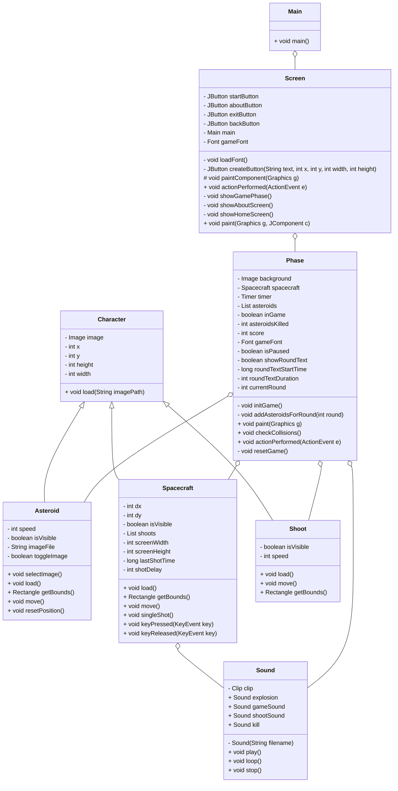

# Javasapiens - Space Fight

## Index
1. [Description of the project](#description-of-the-project)
2. [How to play](#how-to-play)
3. [Requirements](#requirements)
4. [UML Diagram](#uml-diagram)

## Description of the project
Welcome to Space Fight, a game where a spacecraft is sent to save Earth from asteroids heading its way. Embark on a dangerous and thrilling mission that will test your skills.
<p align="center">
  
</p>
<br>
<p align="center">
  
</p>

## How to play
### Game controls:
- `↑`: moves the spacecraft up
- `↓`: moves the spacecraft down
- `→`: moves the spacecraft right
- `←`: moves the spacecraft left
- `Z`: shoots a projectile
- `R`: reset the game
- `ESC`: pause the game

### Asteroids:
The asteroids descend at different speeds, so be careful because if they collide with you, you will be destroyed!

### Rounds:
The game contains 5 rounds that increase in difficulty as the number of asteroids becomes increasingly larger.

### Score:
Each time an asteroid is destroyed by the player, the score increases by 50 points and can be viewed at the top of the screen or when the player loses to be able to view his progress. The maximum possible score in the game is 7500.

### How to win:
After destroying all waves of asteroids, you will win the game.

## Requirements
- Java version: 21+
- SDK: 22+

## UML Diagram


# Design Patterns / Tests

## What was done

In this Java game project, five different design patterns were applied to enhance the organization and structure of the code. Additionally, tests were implemented to ensure functionality and reliability.

## How to run

To run the project, follow the steps below:
 
1. **Installation**:
   - Clone the repository:
     ```bash
     git clone https://github.com/GuilhermeAmargo/DesignPattern.git
     ```
3. **Running the project**:
   - To run the project, execute the class *Main* in SpaceFight/src/game/Main.java
  
## Design Patterns Used

1. ***Design Pattern 1***: **Factory** - 
The Factory Method is like a template for creating objects, where subclasses decide how and which object will be created. ***AsteroidFactory (Interface)***:
It defines the contract for creating asteroids, ensuring that any class implementing it follows the same creation pattern. And ***SimpleAsteroidFactory (Implementation)***:
It implements the *createAsteroid* method, which creates specific instances of the Asteroid type, loading the necessary images before returning the created object.

```java
// Before

    for (int i = 0; i < numAsteroids; i++) {
            int x = (int) (Math.random() * (920));
            int y = -728 - (int) (Math.random() * 100);

            Asteroid asteroid = new Asteroid(x, y);
            asteroid.load(); //Carrega a imagem e o tamanho dela
            asteroids.add(asteroid); //Adiciona o asteroid
        }

// After

    for (int i = 0; i < numAsteroids; i++) {
            int x = (int) (Math.random() * (920));
            int y = -728 - (int) (Math.random() * 100);
            asteroids.add(asteroidFactory.createAsteroid(x, y));
        }
```


2. ***Design Pattern 2***: **State** -
The State pattern allows an object to behave differently depending on its current state. ***HomeScreenState***: Represents the game state on the home screen. It changes the interface to display the main menu or the home screen. ***GamePhaseState***: Represents the game state when it is in a specific phase. It changes the screen to display the current phase.
***GameState (Interface)***: Defines the general actions of the game, such as displaying a screen or handling input events.
***ScreenState (Interface)***: Defines a contract for different states, requiring the classes that implement it to define the *showScreen* method, responsible for displaying the corresponding screen.

```java
// Before

    @Override
    public void actionPerformed(ActionEvent e) {
        if (e.getSource() == startButton) {
            showGamePhase(); // Mostra a fase do jogo
        } else if (e.getSource() == aboutButton) {
            showAboutScreen(); // Mostra a tela "Sobre"
        } else if (e.getSource() == exitButton) {
            System.exit(0); // Sai do jogo
        } else if (e.getSource() == backButton) {
            showHomeScreen(); // Volta para a tela inicial
        }
    }

    // Método para mostrar a fase do jogo
    private void showGamePhase() {
        main.getContentPane().removeAll(); // Remove todos os componentes da tela principal
        Phase phase = new Phase(); // Cria um novo painel da fase
        main.getContentPane().add(phase); // Adiciona a fase à tela principal
        main.revalidate();
        main.repaint();
        phase.requestFocusInWindow(); // Define o foco na nova fase
    }

    // Método para mostrar a tela "Sobre"
    private void showAboutScreen() {
        main.getContentPane().removeAll(); // Remove todos os componentes da tela principal

        // Cria um JLabel para exibir a imagem
        ImageIcon aboutImage = new ImageIcon("res/tela_aboutscreen.png");
        JLabel imageLabel = new JLabel(aboutImage);
        backButton.setBounds(790, 500, 200, 50); // Define a posição do botão "BACK"

        imageLabel.setBounds(0, 0, aboutImage.getIconWidth(), aboutImage.getIconHeight()); // Define a posição da imagem

        // Cria um novo painel para a tela "Sobre"
        JPanel aboutPanel = new JPanel(null);
        aboutPanel.add(backButton); // Adiciona o botão "BACK" ao painel "Sobre"
        aboutPanel.add(imageLabel); // Adiciona a imagem ao painel "Sobre"

        main.getContentPane().add(aboutPanel); // Adiciona o painel "Sobre" à janela principal

        main.revalidate();
        main.repaint(); // Revalida e redesenha a janela principal
    }

    // Método para mostrar a tela inicial
    private void showHomeScreen() {
        main.getContentPane().removeAll(); // Remove todos os componentes da tela principal
        main.getContentPane().add(new Screen(main)); // Adiciona uma nova instância da tela inicial
        main.revalidate();
        main.repaint(); // Revalida e redesenha a janela principal
    }

// After

    @Override
    public void actionPerformed(ActionEvent e) {
        if (e.getSource() == startButton) {
            currentState = new GamePhaseState(); // Mostra a fase do jogo
        } else if (e.getSource() == aboutButton) {
            currentState = new AboutScreenState(); // Mostra a tela "Sobre"
        } else if (e.getSource() == exitButton) {
            System.exit(0); // Sai do jogo
        } else if (e.getSource() == backButton) {
            currentState = new HomeScreenState(); // Volta para a tela inicial
        }

        currentState.showScreen(this);
    }

    public class AboutScreenState implements ScreenState {

        @Override
        public void showScreen(Screen context) {
            context.getMain().getContentPane().removeAll();

            ImageIcon aboutImage = new ImageIcon("res/tela_aboutscreen.png");
            JLabel imageLabel = new JLabel(aboutImage);
            JButton backButton = context.getBackButton();
            backButton.setBounds(790, 500, 200, 50);

            imageLabel.setBounds(0, 0, aboutImage.getIconWidth(), aboutImage.getIconHeight());

            JPanel aboutPanel = new JPanel(null);
            aboutPanel.add(backButton);
            aboutPanel.add(imageLabel);

            context.getMain().getContentPane().add(aboutPanel);
            context.getMain().revalidate();
            context.getMain().repaint();
        }
    }

    public class GamePhaseState implements ScreenState {

        @Override
        public void showScreen(Screen context) {
            context.getMain().getContentPane().removeAll();
            Phase phase = new Phase();
            context.getMain().getContentPane().add(phase);
            context.getMain().revalidate();
            context.getMain().repaint();
            phase.requestFocusInWindow();
        }
    }

    public class HomeScreenState implements ScreenState {

        @Override
        public void showScreen(Screen context) {
            context.getMain().getContentPane().removeAll();
            Screen homeScreen = new Screen(context.getMain());
            context.getMain().getContentPane().add(homeScreen);
            context.getMain().revalidate();
            context.getMain().repaint();
        }
    }

```


3. ***Design Pattern 3***: **Command** -
The Command pattern turns a request into an object, allowing flexibility to configure, store, or undo actions. ***Command (Interface)***:
It defines the contract for all commands, requiring the classes that implement it to provide the *execute()* method. This method represents the action that will be performed.

```java
// Before

     public void keyPressed(KeyEvent tecla) {
        int code = tecla.getKeyCode();

        if (code == KeyEvent.VK_Z) {
            singleShot();
        }
        if (code == KeyEvent.VK_UP) {
            dy = -4;
        }
        if (code == KeyEvent.VK_DOWN) {
            dy = 4;
        }
        if (code == KeyEvent.VK_RIGHT) {
            dx = 4;
        }
        if (code == KeyEvent.VK_LEFT) {
            dx = -4;
        }
    }

    public void keyRelease(KeyEvent tecla) {
        int code = tecla.getKeyCode();

        if (code == KeyEvent.VK_UP) {
            dy = 0;
        }
        if (code == KeyEvent.VK_DOWN) {
            dy = 0;
        }
        if (code == KeyEvent.VK_RIGHT) {
            dx = 0;
        }
        if (code == KeyEvent.VK_LEFT) {
            dx = 0;
        }
    }

// After

        private void initializeCommands() {
        // Movimentos
        commandMap.put(KeyEvent.VK_UP, () -> setDy(-4)); // Movimento para cima
        commandMap.put(KeyEvent.VK_DOWN, () -> setDy(4)); // Movimento para baixo
        commandMap.put(KeyEvent.VK_LEFT, () -> setDx(-4)); // Movimento para a esquerda
        commandMap.put(KeyEvent.VK_RIGHT, () -> setDx(4)); // Movimento para a direita

        // Parar movimentos
        commandMap.put(KeyEvent.VK_UP + 1000, () -> setDy(0));
        commandMap.put(KeyEvent.VK_DOWN + 1000, () -> setDy(0));
        commandMap.put(KeyEvent.VK_LEFT + 1000, () -> setDx(0));
        commandMap.put(KeyEvent.VK_RIGHT + 1000, () -> setDx(0));

        // Comando para atirar
        commandMap.put(KeyEvent.VK_Z, this::singleShot); // Tiro ao pressionar espaço
    }

```


4. ***Design Pattern 4***: **Template** -
The Template Method defines the step-by-step process, allowing subclasses to modify certain details without changing the structure. ***Character***: The Template pattern is used to define the sequence of operations for loading and configuring a character. The loadCharacter method controls the main flow: it loads the character's image and then calls the *onCharacterLoaded()* method, which is implemented by subclasses to customize behavior after loading.

```java
// Before

    public abstract class Character {
    private Image image;
    private int x, y;
    private int height, width;

    //Posição da criação do personagem
    public Character(int x, int y){
        this.x = x;
        this.y = y;
    }

    //Imagem e tamanho do personagem
    public void load(String imagePath){
        ImageIcon reference = new ImageIcon(imagePath);
        image = reference.getImage();
        height = image.getHeight(null);
        width = image.getWidth(null);
    }

    public Image getImage() {
        return image;
    }

    public void setImage(Image image) {
        this.image = image;
    }

    public int getX() {
        return x;
    }

    public void setX(int x) {
        this.x = x;
    }

    public int getY() {
        return y;
    }

    public void setY(int y) {
        this.y = y;
    }

    public int getHeight() {
        return height;
    }

    public void setHeight(int height) {
        this.height = height;
    }

    public int getWidth() {
        return width;
    }

    public void setWidth(int width) {
        this.width = width;
    }

    // Carrega a imagem selecionada
    public abstract void load();

    // Obtém os limites para detecção de colisão
    public abstract Rectangle getBounds();
}

// After

    public abstract class Character {
    private Image image;
    private int x, y;
    private int height, width;

    //Posição da criação do personagem
    public Character(int x, int y){
        this.x = x;
        this.y = y;
    }

    //Imagem e tamanho do personagem
    public final void loadCharacter(String imagePath){
        loadImage(imagePath);
        onCharacterLoaded();
    }

    private void loadImage (String imagePath){
        ImageIcon reference = new ImageIcon(imagePath);
        image = reference.getImage();
        height = image.getHeight(null);
        width = image.getWidth(null);
    }

    protected  abstract void onCharacterLoaded();

    public Image getImage() {
        return image;
    }

    public int getX() {
        return x;
    }

    public void setX(int x) {
        this.x = x;
    }

    public int getY() {
        return y;
    }

    public void setY(int y) {
        this.y = y;
    }

    public int getHeight() {
        return height;
    }
    public int getWidth() {
        return width;
    }

    public abstract Rectangle getBounds();
}

```

5. ***Design Pattern 5***: **Singleton** -
The Singleton ensures that a class has only one instance and provides a single access point to that instance. ***Sound***: The Singleton pattern ensures that there is only one instance to manage the sounds. The *getInstance* method creates the instance Orly when necessary, avoiding multiple instances and centralizing sound control in the game.

```java
// Before

    public class Sound {
        private Clip clip;

        public static final Sound explosion = new Sound("res\\Explosion.wav");
        public static final Sound soundgame = new Sound("res\\som de fundo.wav");
        public static final Sound soundShoot = new Sound("res\\Laser_Shoot.wav");
        public static final Sound kill = new Sound("res\\sound_kill.wav");

        private Sound(String filename) {
            try {
                AudioInputStream audioInputStream = AudioSystem.getAudioInputStream(new File(filename));
                clip = AudioSystem.getClip();
                clip.open(audioInputStream);
            } catch (UnsupportedAudioFileException | IOException | LineUnavailableException e) {
                e.printStackTrace();
            }
        }

        //Método para começar o som
        public void play() {
            if (clip != null) {
                new Thread(() -> {
                    clip.setFramePosition(0);
                    clip.start();
                }).start();
            }
        }

        //Método para deixar o som em loop
        public void loop() {
            if (clip != null) {
                new Thread(() -> {
                    clip.setFramePosition(0);
                    clip.loop(Clip.LOOP_CONTINUOUSLY);
                }).start();
            }
        }

        //Método para parar o som
        public void stop() {
            if (clip != null) {
                clip.stop();
            }
        }
    }

// After

        public class Sound {
        private static Sound instance;
        private Clip clip;

        public static final Sound explosion = new Sound("res\\Explosion.wav");
        public static final Sound soundgame = new Sound("res\\som de fundo.wav");
        public static final Sound soundShoot = new Sound("res\\Laser_Shoot.wav");
        public static final Sound kill = new Sound("res\\sound_kill.wav");

        private Sound(String filename) {
            try {
                AudioInputStream audioInputStream = AudioSystem.getAudioInputStream(new File(filename));
                clip = AudioSystem.getClip();
                clip.open(audioInputStream);
            } catch (UnsupportedAudioFileException | IOException | LineUnavailableException e) {
                e.printStackTrace();
            }
        }

        public static Sound getInstance(String filename) {
            if (instance == null) {
                instance = new Sound(filename);
            }
            return instance;
        }

        //Método para começar o som
        public void play() {
            if (clip != null) {
                new Thread(() -> {
                    clip.setFramePosition(0);
                    clip.start();
                }).start();
            }
        }

        //Método para deixar o som em loop
        public void loop() {
            if (clip != null) {
                new Thread(() -> {
                    clip.setFramePosition(0);
                    clip.loop(Clip.LOOP_CONTINUOUSLY);
                }).start();
            }
        }

        //Método para parar o som
        public void stop() {
            if (clip != null) {
                clip.stop();
            }
        }
    }
```


## Test used

***Sound:*** This test checks if the Singleton pattern in the *Sound* class creates only one instance. It plays the sounds in a loop for 5 seconds and stops them, confirming the single instance control and sound execution.

````java
package game_models;

public class SoundTest {
    public static void main(String[] args) {
        // Obtém instâncias de som
        Sound sound1 = Sound.getInstance("res\\Laser_Shoot.wav");
        Sound sound2 = Sound.getInstance("res\\Explosion.wav");


        if (sound1 == sound2) {
            System.out.println("Teste Singleton: PASSOU (somente uma instância foi criada)");
        } else {
            System.out.println("Teste Singleton: FALHOU (mais de uma instância foi criada)");
        }

        System.out.println("Tocando som em loop...");
        sound1.loop();
        sound2.loop();

        try {
            Thread.sleep(5000);
        } catch (InterruptedException e) {
            e.printStackTrace();
        }

        // Para o som
        sound1.stop();
        sound2.stop();
        System.out.println("Som parado.");
    }
}
````

**AsteroidFactoryTest:** This test verifies if the SimpleAsteroidFactory class, an implementation of AsteroidFactory, correctly creates instances of Asteroid. It generates an asteroid at coordinates (100, 200) and validates that the object is not null and its coordinates are correctly set. Confirms the reliability of asteroid creation and adherence to expected properties.

```java
public class AsteroidFactoryTest {

    @Test
    public void testCreateAsteroid() {
        AsteroidFactory factory = new SimpleAsteroidFactory();
        Asteroid asteroid = factory.createAsteroid(100, 200);

        assertNotNull(asteroid, "Asteroid should not be null");
        assertEquals(100, asteroid.getX(), "Asteroid X position should be 100");
        assertEquals(200, asteroid.getY(), "Asteroid Y position should be 200");
    }
}
```
## Authors

- Guilherme Camardo Silva
- João Pedro V. A.
- Thomas V. Steinhoff